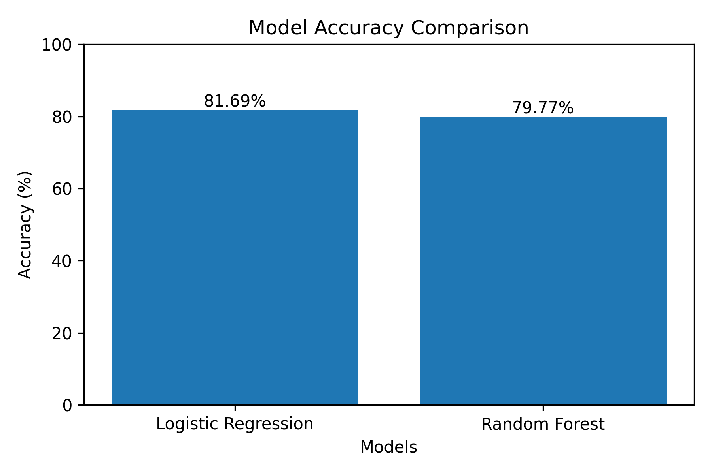
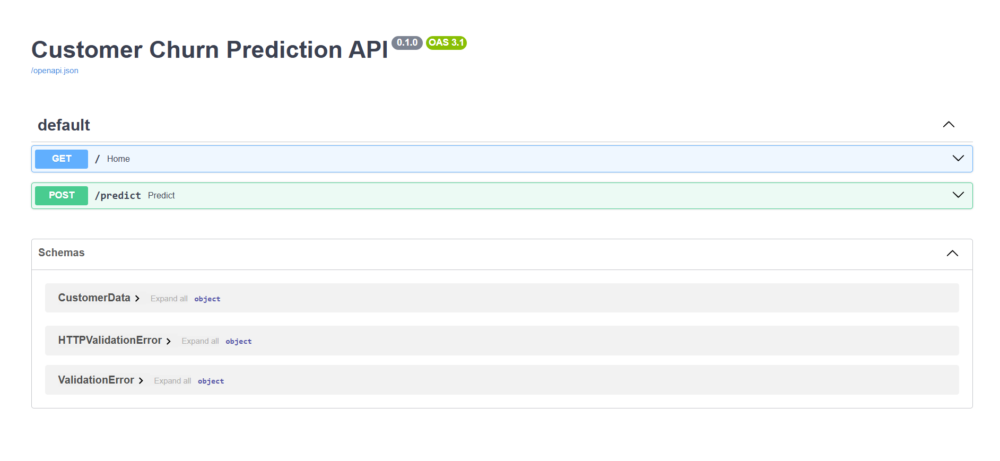
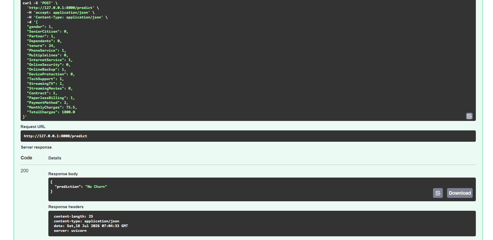

#  🤖 Customer Churn Prediction using Machine Learning


## 📌 Project Overview

This project predicts whether a telecom customer is likely to churn (leave the service) using Machine Learning.

It demonstrates an end-to-end machine learning workflow, including:

- Data preprocessing
- Feature encoding
- Model training
- Model evaluation
- REST API development using FastAPI
- Model deployment readiness

The project was built as part of an AI engineering assignment to demonstrate practical machine learning and API development skills.

---
## 🔄 Project Workflow

```text
Dataset
   │
   ▼
Data Cleaning
   │
   ▼
Feature Encoding
   │
   ▼
Train/Test Split
   │
   ▼
Machine Learning Models
(Logistic Regression & Random Forest)
   │
   ▼
Best Model Selection
   │
   ▼
FastAPI Deployment
   │
   ▼
Prediction API
```
---
# 🎯 Problem Statement

Customer churn is a major challenge for telecom companies. Predicting which customers are likely to leave helps businesses take proactive steps to improve customer retention and reduce revenue loss.

This project uses customer information such as contract type, tenure, payment method, and monthly charges to predict customer churn.

---

# 🛠️ Technologies Used

| Technology | Purpose |
|------------|---------|
| Python | Programming Language |
| Pandas | Data Processing |
| NumPy | Numerical Operations |
| Scikit-Learn | Machine Learning |
| FastAPI | REST API |
| Joblib | Model Serialization |
| Uvicorn | API Server |

---

# 📂 Dataset

**Dataset:** IBM Telco Customer Churn Dataset

The dataset contains customer demographic information, service details, billing information, and the target variable **Churn**.

### Target Variable

- Yes → Customer will churn
- No → Customer will not churn

---

# ⚙️ Data Preprocessing

The following preprocessing steps were performed:

- Removed unnecessary columns
- Handled missing values
- Converted data types
- Encoded categorical variables using Label Encoding
- Split dataset into training and testing sets

---

# 🤖 Machine Learning Models

Two classification models were trained and evaluated:

1. Logistic Regression
2. Random Forest Classifier

The models were compared using:

- Accuracy
- Precision
- Recall
- F1 Score

---

# 📊 Model Performance

| Model | Accuracy | Precision | Recall | F1 Score |
|--------|---------:|----------:|-------:|---------:|
| Logistic Regression | **81.69%** | **68.03%** | **58.18%** | **62.72%** |
| Random Forest | **79.77%** | **66.42%** | **47.72%** | **55.54%** |

**Selected Model:** Logistic Regression (highest accuracy)

---
## 📈 Model Accuracy Comparison



---
# 🌐 REST API

The trained model is served using **FastAPI**.

### Endpoint

```
POST /predict
```

### Sample Request

```json
{
  "gender": 1,
  "SeniorCitizen": 0,
  "Partner": 1,
  "Dependents": 0,
  "tenure": 24,
  "PhoneService": 1,
  "MultipleLines": 0,
  "InternetService": 1,
  "OnlineSecurity": 0,
  "OnlineBackup": 1,
  "DeviceProtection": 0,
  "TechSupport": 1,
  "StreamingTV": 1,
  "StreamingMovies": 0,
  "Contract": 1,
  "PaperlessBilling": 1,
  "PaymentMethod": 2,
  "MonthlyCharges": 75.5,
  "TotalCharges": 1800.0
}
```

### Sample Response

```json
{
    
  "prediction": "No Churn",
  "model": "Logistic Regression",
  "status": "Success"

}
```

---

# 📁 Project Structure

```
customer-churn-prediction/

│── app.py
│── train.py
│── model.pkl
│── dataset.csv
│── requirements.txt
│── README.md

├── screenshots/
│     ├── swagger.png
│     └── prediction.png
```

---

# ▶️ Installation

Clone the repository

```bash
git clone https://github.com/YOUR_USERNAME/customer-churn-prediction.git
```

Navigate to the project

```bash
cd customer-churn-prediction
```

Install dependencies

```bash
pip install -r requirements.txt
```

Train the model

```bash
python train.py
```

Run the API

```bash
uvicorn app:app --reload
```

Open

```
http://127.0.0.1:8000/docs#/
```

---

# 📷 Screenshots

## 📷 Swagger Documentation



---

## 📷 Prediction Result


---

# 🚀 Future Improvements

- Hyperparameter tuning
- Feature engineering
- Cross-validation
- Model deployment on cloud platforms
- Interactive frontend dashboard

---

# 👨‍💻 Author

**Lewin Johnson**

B.Tech Computer Science & Design

GitHub: https://github.com/YOUR_USERNAME